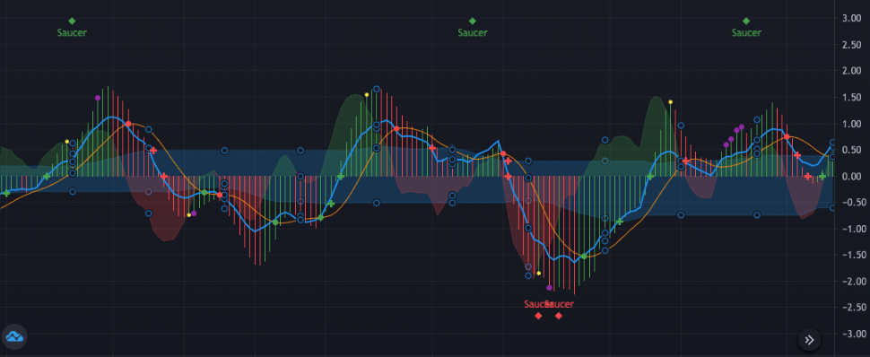
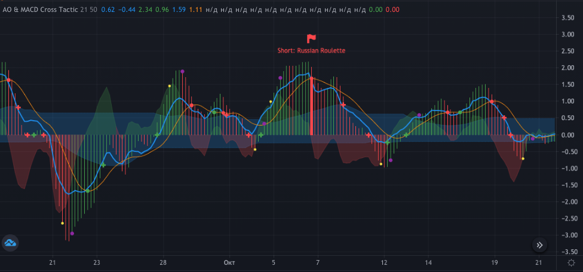
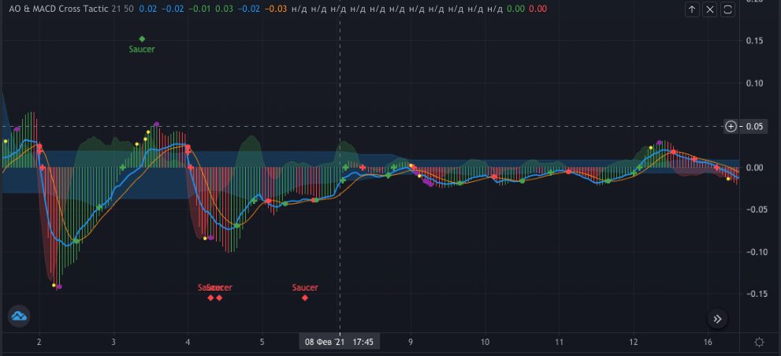
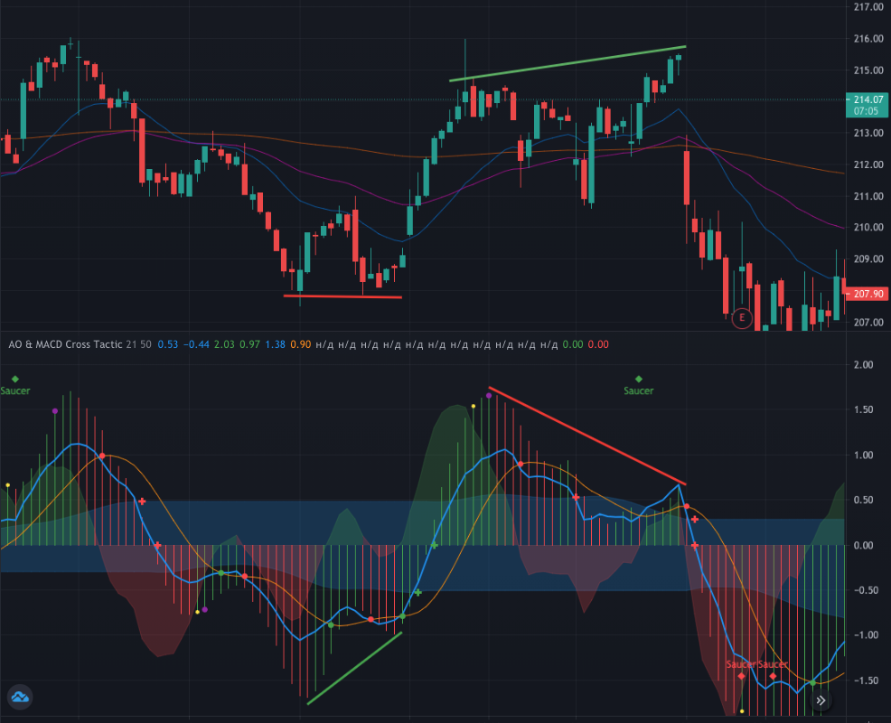
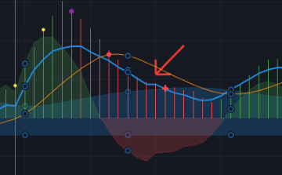
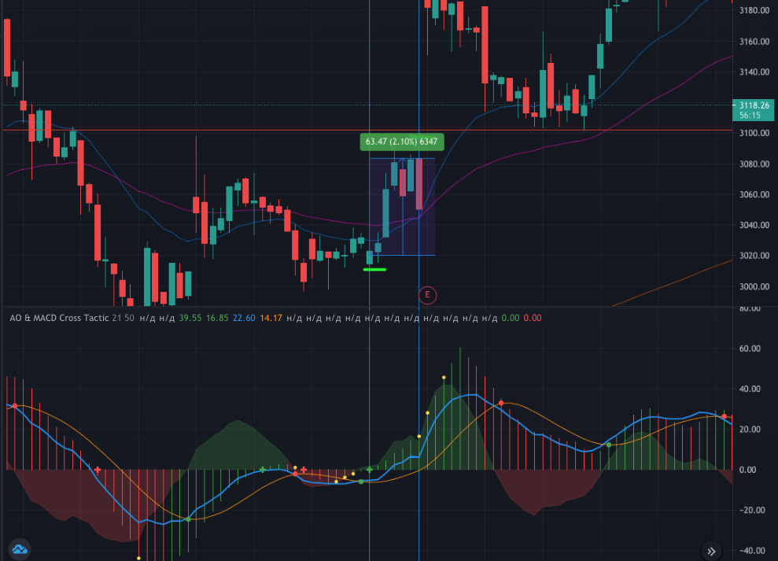
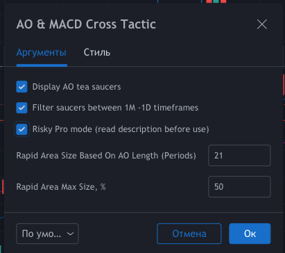
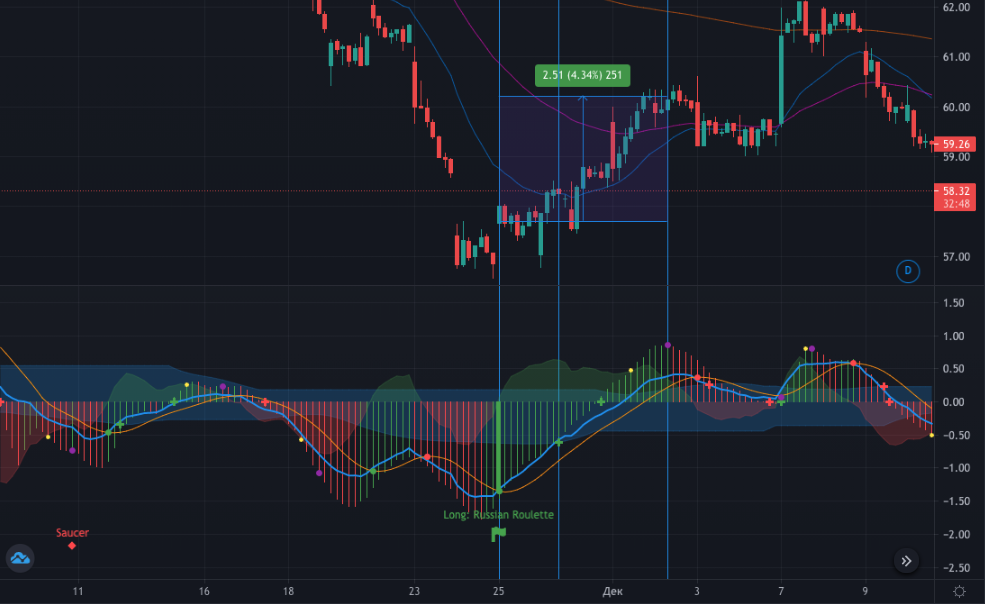

# AO & CDMACD Script

Oscillator for Tradingview based on CTMACD and AO. This oscillator is designed to identify potential local growth or decline in prices as part of a trend movement.

It shows itself best in stocks, that they move with regular cooldowns, so on the CTMACD oscillator they are closer to a sinusoid than others. For example SBER is quite suitable for this role. On "Apple", the oscillator is not very efficient.

> **Warning: the oscillator is provided for educational purposes. Relying on an oscillator alone is very dangerous and unwise. All the actions you perform on your own risk.**

To understand what is happening and what this oscillator is based on, you need to the basics:

1. SMA and EMA - what is the difference and how are they calculated.
2. Oscillator MACD.
3. Bill Williams' Awesome Oscillator (AO).

An oscillator consists of 4 main components:

- AO histogram (red-Greennish bars)
- CTMACD chart (presented as a red-Greennish area)
- Intersections of CTMACD lines - Main and Signal
- Cloud of Rapid Reaction area - optional

**Rapid Reaction area** - an optional field that can be enabled in the script settings (Risky Mode Pro). This zone is calculated as SMA AO with a period of 21 followed by a 50% correction (these values are subject to change). The goal of the reaction area is to Rapid to mark the area where the signal often likes the opposite, without breaking through the 0 axis. More details on how to work with it will be described below in the strategy section.

There are also additional symbols provided in the pivot graphic to serve as visual markers:

1. **Greennish / red dots** - bullish or bearish CTMACD crossover line
2. **Greennish / red plus sign** - a potential trend and a possible position entry point. It is located at the intersection of the O-axis zero or when the CTMACD line crosses the Rapid reaction area.
3. **Greennish / red flag with a highlighted column** - the most risky but profitable entry point. Russian roulette. It is activated only in a risky mode. It is only formed when the CTMACD lines cross at a level that is at least 75% of the previous AO high / low in the last 50 periods. At the same time, the crossing itself should be 2 times farther from the borders of the rapid response zone. This signal works best with RSI and STOCH. Its purpose: to catch maximum rejections in strong oversold / overbought conditions.
4. **Greennish / Red Saucer Diamond** - Tea saucer shape on the Awesome Oscillator. This is often completed within a limited time frame. For example, a saucer on a 1-hour chart is best placed within a specific day.
5. **Yellow dot** - the potential closing point of the trade with the lowest risk. It is considered to be the intersection of the CTMACD and AO histograms.
6. **Purple dot** - a possible close with a slightly higher risk. This is considered to be the intersection of the CTMACD line with the CTMACD chart.

Dots serve only as visual markers, do not trigger action. Keep this in mind.

## How to use

The basic principle is to build confidence in the formation of a local trend. The markers on the graph will help with this. But there are some points worth paying attention to.

### Wide spread

The AO  and CTMACD chart should be larger than in the reaction area. In other words, higher vol. Here is a ** correct example ** where there are signal due to volatility:

But at such moments it is better not to do anything when the channel is narrowing:

If a + sign is forming in a narrow channel without a preceding dot (of the same color), it is highly recommended to enter the trade.

### Focus on MACD

Sometimes you can close a trade without waiting for the CTMACD reversal signal. For example, when the lines are dangerously close. This confidence can be enhanced with RSI and Stoch.

### Divergences

Since the main structure of the generator is based on AO and MACD, nobody canceled their classic divergences. Differences should also be taken into account when forming your opinion about future price movements.

This diagram shows the divergence options for the Awesome Oscillator and their processing along with the main scenario signals:

The bullish divergence is confirmed by the signal generator (Greennish + sign). Likewise, bearish divergence, in which the bullish tea saucer even manages to work, just before the price falls.

### MACD angle

When the first the + sign to enter a trade, the angle of attack of the blue MACD line must be carefully controlled. If the line approaches the axis almost parallel, then it is better not to enter into a trade, since at any moment the situation may not be in your direction.

### Caution: step down

Sometimes on the generator, you can find a step formed by the blue MACD line, which is below 0 degrees along the AO. You should avoid entering a trade when the step is forming, as this could signal a reversal against you. Of course, it is worth checking the situation on smaller timeframes.

## Possible strategies

This scenario involves two main strategies: the simple conservative and the risky (Pro). For a simple strategy, a minimum of information is provided - a signal to confirm a reversal appears near the end of the movement itself. With its help, you can enter fast trades for 0.5% -2% profit with a stop at breakeven. The risky strategy is somewhat more complicated. More about them below.

### Simple conservative

You are looking for the Greennish crossover point of CTMACD in the minus zone and are waiting for confirmation from the AO. When the AO turns in the plus trend (forms plus a sign on the axis), we enter a trade.

The closest point to exit the trade will be highlighted in yellow. The example below illustrates this situation.

To the left of a successful transaction, you can draw attention to a failed one. In this case, you should always pay attention to the angle at which the blue CTMACD line approaches the axis.

### Risky strategy

In order to enable it, you need to open the script settings and checkboxes, as in the example below:

The challenge for a risky strategy is to find as many reversal signals as possible before it is confirmed in order to take big profits.

CTMACD signals are filtered by Rapid Response Zone. The entry point may be the intersection of the CTMACD line of this zone (the + sign).

An alternative entry point could be a Russian roulette game in the hopes of catching a good bounce. The figure shows three entry points at once - roulette, risky and conservative. The exit point is purple.

The higher the risk, the greater the profit and the earlier the entry. As well as potential losses.

In other cases, you should also look for divergences and plates to support your theory.

** What is the main catch of a risk management strategy? ** And the fact is that for each stock and each timeframe, you have to manually select the parameters of the reaction area. The number of periods should be adjusted at your discretion. The greatest attention should be paid to the size of this zone.

The smaller the response zone, the lower the risk of the transaction. The size of the zone should be selected individually - to evaluate according to the history of the stock, how many unsuccessful deals could have been avoided with a smaller zone? This point is as subjective as possible, but important. The size of the influence zone is, among other things, the calculation of the entry points of the roulette-type risk.

> > Material is based solely on the experience of the author. Not individual investment advice.
